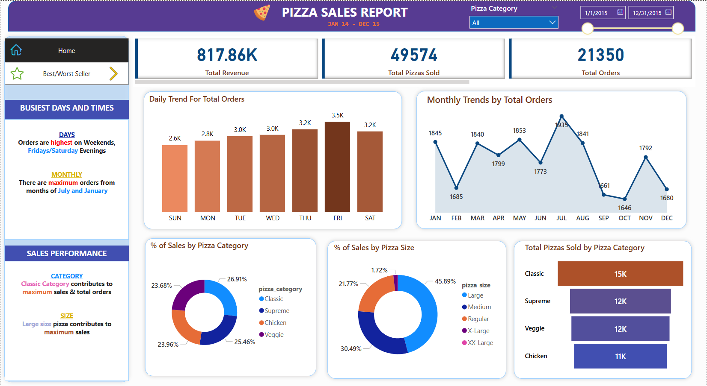
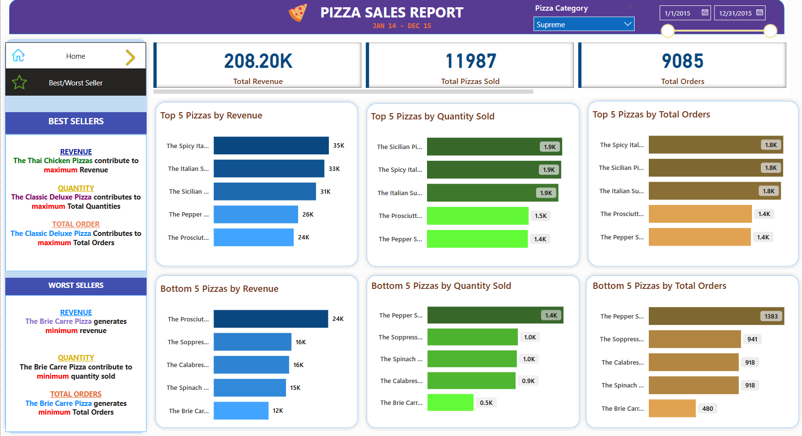

# 🍕 Pizza Sales Analysis Dashboard (Power BI)


## 📌 Project Overview

This project is a **Business Intelligence dashboard** built with **Power BI** to analyze pizza sales data and generate actionable business insights.

It helps stakeholders understand:
- Overall sales performance
- Customer ordering behavior
- Best & worst selling pizzas
- Revenue by pizza category and size
- Monthly & quarterly sales trends

> 💡 This project showcases skills in **data analysis**, **data modeling**, **DAX**, and **interactive dashboard design**.

---

## 🎯 Project Objectives

- Analyze total pizza sales performance  
- Identify top-performing and low-performing pizzas  
- Understand customer purchase patterns  
- Track revenue trends over time  
- Support data-driven decision making  

---

## 📊 Dashboard Pages

The Power BI report contains **two interactive dashboard pages**:

### 1️⃣ Pizza Sales Overview Dashboard

High-level summary of sales performance.

#### 📈 Key Performance Indicators (KPIs)

| Metric                   | Value     |
|--------------------------|-----------|
| Total Revenue            | $817.86K  |
| Total Orders             | 21K       |
| Average Order Value      | $38.31    |
| Total Pizzas Sold        | 50K       |
| Average Pizzas per Order | 2.32      |

#### 📅 Total Orders by Day
- **Friday** has the highest orders  
- **Sunday** has the lowest orders  

#### 📊 Total Orders by Month
- Orders increase steadily through the year  
- Peak sales occur around **mid-year months**

#### 📉 Total Revenue by Quarter
- **Q2** generates the highest revenue  
- Slight decline toward Q4  

#### 🍕 Revenue by Pizza Category
- **Classic** pizzas generate the highest revenue share  
- Categories: Classic, Supreme, Chicken, Veggie  

#### 📏 Revenue by Pizza Size
- **Large (L)** pizzas contribute ~46% of total revenue  
- **XXL** pizzas contribute the least  

#### 🍕 Total Pizzas Sold by Category
- **Classic** pizzas are the most popular  
- **Chicken** pizzas have the lowest sales quantity  

---

### 2️⃣ Best & Worst Sellers Dashboard

Highlights top and bottom performers by revenue, orders, and quantity.

#### 🔝 Top 5 Pizzas by Revenue
1. The Thai Chicken Pizza  
2. The Barbecue Chicken Pizza  
3. The California Chicken Pizza  
4. The Classic Deluxe Pizza  
5. The Spicy Italian Pizza  

#### 🔝 Top 5 Pizzas by Total Orders
1. Classic Deluxe Pizza  
2. Hawaiian Pizza  
3. Pepperoni Pizza  
4. Barbecue Chicken Pizza  
5. Thai Chicken Pizza  

#### 🔻 Bottom 5 Pizzas by Revenue
1. Brie Carre Pizza  
2. Green Garden Pizza  
3. Spinach Supreme Pizza  
4. Mediterranean Pizza  
5. Spinach Pesto Pizza  

#### 🔻 Bottom 5 Pizzas by Quantity
1. Brie Carre Pizza  
2. Mediterranean Pizza  
3. Calabrese Pizza  
4. Soppressata Pizza  
5. Spinach Supreme Pizza  

---

## 🛠 Tools & Technologies Used

| Tool            | Purpose                     |
|----------------|-----------------------------|
| Power BI        | Dashboard development       |
| Power Query     | Data cleaning               |
| DAX             | Calculations & measures     |
| Excel / CSV     | Data source                 |
| SQL             | Data querying               |

---

## 📂 Project Structure

```
Pizza-Sales-PowerBI-Dashboard
│
├── Dataset
│   └── pizza_sales.csv
├── Dashboard
│   └── Pizza_Sales_Dashboard.pbix
├── Images
│   ├── sales_dashboard.png
│   └── best_worst_dashboard.png
├── SQL
│   └── pizza_sales_queries.sql
└── README.md
```

---

## 🧮 Key DAX Measures

```dax
Total Revenue = SUM(pizza_sales[total_price])

Total Orders = DISTINCTCOUNT(pizza_sales[order_id])

Total Pizzas Sold = SUM(pizza_sales[quantity])

Avg Order Value = DIVIDE([Total Revenue], [Total Orders])

Avg Pizzas Per Order = DIVIDE([Total Pizzas Sold], [Total Orders])
```

---

## 📊 Data Analysis Workflow

1. Data Collection  
2. Data Cleaning (Power Query)  
3. Data Modeling  
4. DAX Calculations  
5. Dashboard Development  
6. Business Insights Generation  

---

## 📸 Dashboard Preview

**Sales Overview Dashboard**  
  

**Best & Worst Sellers Dashboard**  


---

## 📈 Key Business Insights

1. **Peak Sales Days** – Friday & Thursday have the highest order volumes  
2. **Best Performing Category** – Classic pizzas generate the most revenue & quantity  
3. **Preferred Pizza Size** – Large pizzas are most popular  
4. **Seasonal Pattern** – Sales increase through the year, peaking in mid-year  
5. **Underperforming Products** – Certain pizzas consistently appear in bottom lists → opportunity for menu optimization  

---

## 🚀 How to Use the Dashboard

1. Clone or download the repository  
2. Open the `.pbix` file in Power BI Desktop  
3. Load the dataset if prompted  
4. Explore using slicers and filters  

---

## 👨‍💻 Author

**Austine Njuga**  
Aspiring Data Analyst / Data Scientist

---


